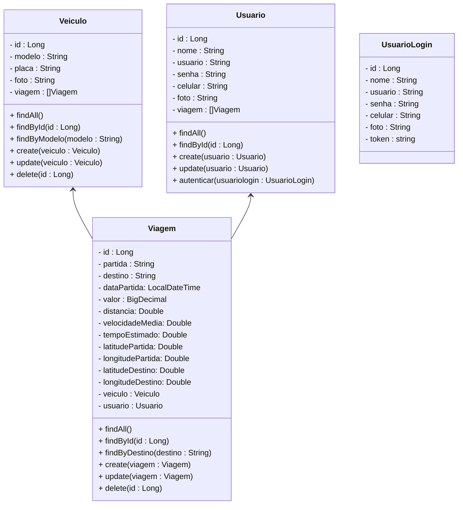
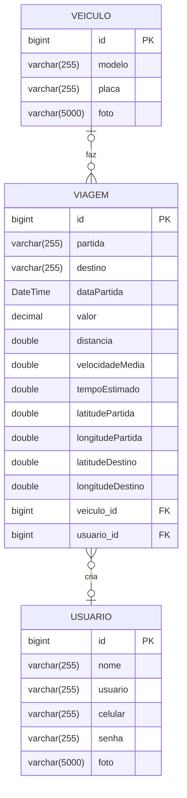

# Projeto Carona Compartilhada - Backend

 

    

  

## 1. Descrição

Um sistema de **Caronas Compartilhadas** é uma plataforma que permite que pessoas que fazem trajetos semelhantes compartilhem viagens em um mesmo veículo. Este tipo de sistema tem vários benefícios:

1. Redução de custos para os usuários
2. Diminuição do tráfego nas cidades
3. Redução da emissão de poluentes
4. Promoção de interação social

Normalmente, esses sistemas funcionam através de um aplicativo móvel ou plataforma web onde os usuários podem oferecer ou solicitar caronas, definindo rotas, horários e condições da viagem.

 

## 2. Sobre esta API

O Projeto Carona Compartilhada foi desenvolvido utilizando o Framework **Spring** e a Linguagem **Java** para criar a estrutura básica de um sistema de caronas compartilhadas. Ela fornece endpoints para gerenciar os Recursos **Usuário, Veículo e Viagem**, além de calcular automaticamente o trajeto (através das coordenadas dos pontos de partida e chegada), o tempo estimado (com base no horário da partida) e o preço da viagem.

 

### 2.1. Principais Funcionalidades

1. Cadastro e gerenciamento dos usuários
2. Registro e gerenciamento dos veículos
3. Criação e gerenciamento das viagens
4. Cálculo automático do trajeto, tempo e valor estimado de viagem

 

### 2.2. Cálculo do  Trajeto, Tempo  e Preço da Viagem

Para Calcular o o trajeto da viagem, utilizamos 2 APIs:

- **Open Cage**: é uma API que fornece **geocodificação** (conversão de coordenadas em endereços e vice-versa) usando diversas fontes de dados, como o **OpenStreetMap**. A partir do endereço, a Open Cage retorna as coordenadas de Latitude e Longitude.
- **OSRM (Open Source Routing Machine)**: é uma API de **roteamento** que calcula rotas e direções em tempo real usando dados do [Open Street Map](https://www.openstreetmap.org). Permite encontrar o caminho mais rápido entre dois pontos, compostos pelas  coordenadas de latitude e longitude.

Para calcular o tempo, utilizamos como base uma tabela com a velocidade média do trânsito da cidade de São Paulo, de acordo com a faixa de horário.

Para calcular o valor da viagem, utilizamos a seguinte formula:

$$
\text{valor da viagem} = \text{tarifa base} + (\text{distancia km} \times \text{valor km}) + (\text{tempo estimado} \times \text{valor minuto}) + \text{seguro}
$$

- A tarifa base, o valor do KM, o valor do minuto e o seguro são valores fixados
- A distância é um valor calculado a partir da definição da rota
- O tempo estimado é um valor calculado a partir da distância e da velocidade média

Para mais detalhes, acesse a documentação do serviço RotaService **[clicando aqui](calculo_rota.md)**.

 

## 3. Integração com as APIs - Open Cage  e  OSRM

### 3.1. Open Cage

1. Acesse o site do [Open Cage](https://opencagedata.com/)
2. Crie uma conta gratuita
3. Crie uma chave de API (API KEY)
4. Adicione a chave de API em uma variável de ambiente no Projeto Carona Compartilhada

 

### 3.2. OSRM

1. Para utilizar a API OSRM não é necessário fazer Cadastro ou criar chave de API
2. **Link:** [OSRM](https://project-osrm.org/)

 

## 4. Diagrama de Classes

**Observações Importantes:**

- Estamos partindo do princípio de que os carros pertencem a uma frota, que são selecionados pelos motoristas no momento da criação de uma carona, para simplificar a implementação do sistema
- Os atributos valor, distancia, velocidadeMedia, tempoEstimado, latitudePartida, longitudePartida, latitudeDestino e longitudeDestino são campos calculados

 

## 5. Diagrama Entidade-Relacionamento (DER)

 

## 6. Tecnologias utilizadas

| Item                          | Descrição       |
| ----------------------------- | --------------- |
| **Servidor**                  | Tomcat          |
| **Linguagem de programação**  | Java            |
| **Framework**                 | Spring          |
| **ORM**                       | JPA + Hibernate |
| **Banco de dados Relacional** | MySQL           |

 

## 7. Configuração e Execução

1. Clone o repositório
2. Abra o Projeto no STS e aguarde a instalação das dependências
3. Configure o banco de dados no arquivo `application.properties`
4. Configure as variáveis de ambiente no arquivo `.env`
5. Execute a aplicação via STS
